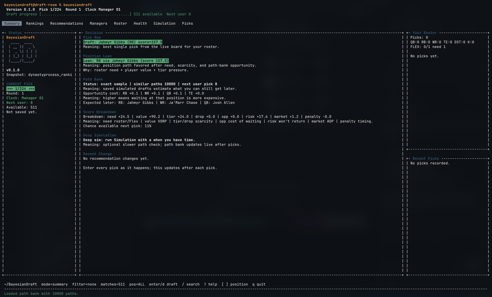
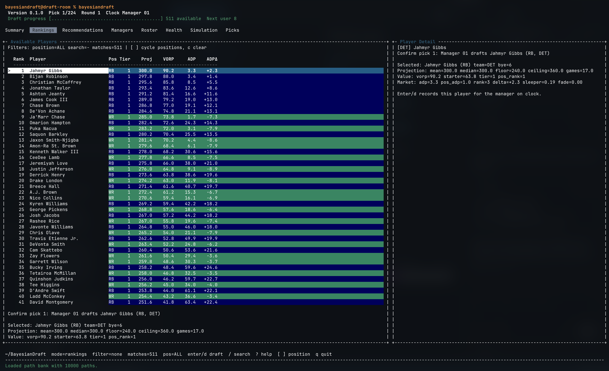
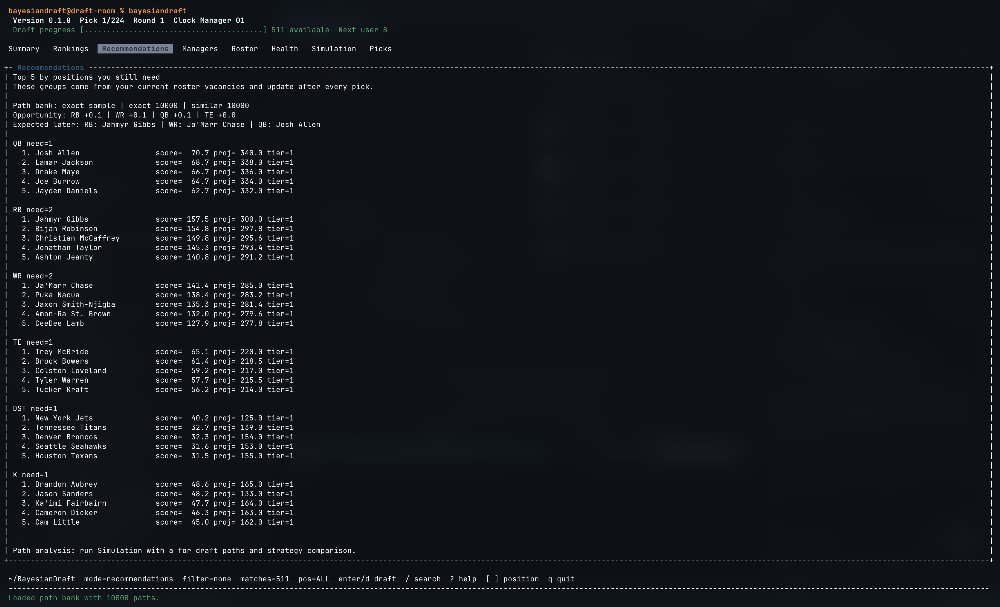

# BayesianDraft

[](https://github.com/sre0089/BayesianDraft/actions/workflows/ci.yml)


BayesianDraft is a local-first fantasy football draft assistant for live snake drafts.

You enter picks as they happen. BayesianDraft keeps the board, rosters, and recommendations updated, then explains why it likes a player instead of just handing you a static ranking.

## What It Helps With

- Track a full draft with manual picks, undo/redo, save/load, and roster views.
- See the best current pick from the live board.
- Compare position-specific options when roster need and player value conflict.
- Understand recommendations through value, need, tier, ADP, risk, and opportunity-cost breakdowns.
- Run seeded simulations and path-bank analysis for extra draft-day context.

## Quick Start

Install dependencies:

```bash
pip install -e ".[dev]"
npm install
```

Run the terminal draft room with the included synthetic fixture data:

```bash
PYTHONPATH=. python scripts/draft_tui.py
```

The fixture is only for trying the workflow. For a real draft, pull or import a player snapshot:

```bash
PYTHONPATH=. python scripts/pull_dynastyprocess.py
PYTHONPATH=. python scripts/draft_tui.py \
  --snapshot data/processed/dynastyprocess_rankings_2026.json
```

Useful fixture smoke checks:

```bash
PYTHONPATH=. python scripts/draft_summary.py
PYTHONPATH=. python scripts/league_report.py
PYTHONPATH=. python scripts/sim_benchmark.py
```

## Draft Room Basics

The TUI starts at pick 1. Enter every pick as it happens, including other managers' picks before your slot. The recommendation updates after each pick.

Core controls:

- Arrow keys: move around
- Enter or `d`: draft selected player
- `/`: live search
- `[` and `]`: position filters
- `u` / `r`: undo and redo
- `s`: save
- `q`: quit

More TUI details: [docs/cli.md](docs/cli.md)

## How Recommendations Work

BayesianDraft scores available players using:

- projected value over replacement
- your open roster needs, including Flex
- tier quality and tier drop-off
- ADP value
- chance the player makes it back to your next pick
- path-bank opportunity cost, when loaded
- penalties for early K/DST or awkward roster construction

The full methodology is in [docs/math-methodology.md](docs/math-methodology.md). A more practical recommendation guide is in [docs/recommendations.md](docs/recommendations.md).

## Screenshots

### Summary



### Rankings



### Recommendations



## Project Layout

- `bayesiandraft/`: core Python engine.
- `apps/api/`: local FastAPI app.
- `apps/web/`: React/Vite draft room.
- `configs/`: public-safe league config.
- `data/`: synthetic fixtures plus ignored local data folders.
- `docs/`: architecture, CLI, methodology, data, and model notes.
- `scripts/`: local import, simulation, validation, and draft-room commands.
- `tests/`: Python tests, with app-specific tests under `apps/`.

## Current Limits

- The main workflow is manual pick entry. ESPN sync is not required.
- The committed player data is synthetic; real draft use needs an imported or pulled snapshot.
- Availability, opponent behavior, and simulations are transparent baselines, not calibrated probabilities.
- Large path banks are best generated before draft time.

## More Docs

- [Documentation index](docs/README.md)
- [Architecture](docs/architecture.md)
- [Simulation and path banks](docs/simulation.md)
- [Data import](docs/data-import.md)
- [Contributing](CONTRIBUTING.md)

## Privacy

BayesianDraft is designed to keep real league data local. Do not commit private league exports, API keys, ESPN cookies, local draft saves, raw downloaded datasets, or real manager names.

For local manager names, use an ignored file like:

```text
configs/leagues/espn_2026.local.yaml
```
